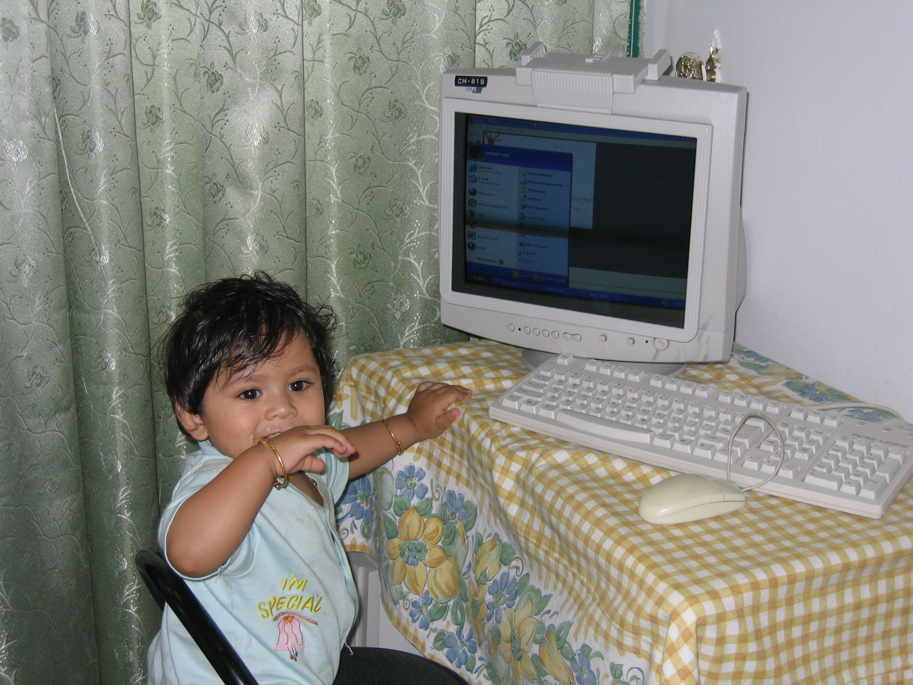

<h1 align="center">Hey there! 👋 I'm Aritra.</h1>

Navigating the digital world—one keystroke at a time. 🚀

### What You'll Find Here:
- 🔭 **Projects**: From AI that tries (and sometimes succeeds) to make your life easier to handy scripts that might save you a few clicks.
- 🧩 **Code Experiments**: Snippets of code and nuggets of math for fun (and learning).
- 📝 Feel free to poke around, star what you like, or suggest improvements!

### Tech I'm Into:
- **Machine Learning** (because data whispers back 🎤)
- **Code Optimization** (because less is more⚡)
- **C++** (for the love of speed 🏎️)
- **Python** (for the love of brevity 🐍)
  
### Quotes I Like:
- *Optimization hinders evolution.* 🦕
- *The future belongs to those who do evals.* 🤖
- *The society that seperates its scholars from its warriors will have its thinking done by cowards and its fighting done by fools*. ⚔️

**Here's the earliest known picture of me with a computer (2006):**

🌟 Let's build something cool together!

📧 Email: aritraghosh534@gmail.com  
🔗 [LinkedIn](https://www.linkedin.com/in/ghosh-aritra/)

<!---
arighosh05/arighosh05 is a ✨ special ✨ repository because its `README.md` (this file) appears on your GitHub profile.
You can click the Preview link to take a look at your changes.
--->
